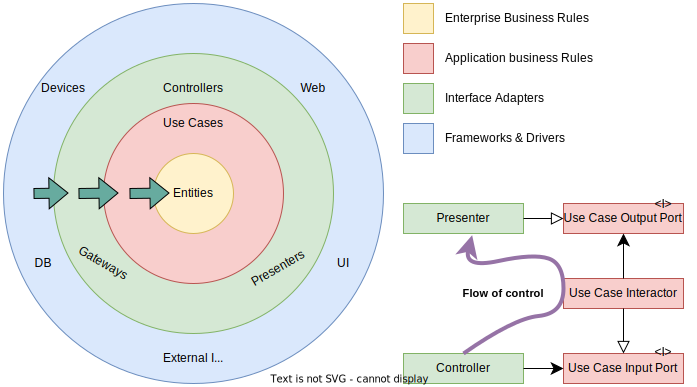

<h1>Clean Architecture</h1>

<figure>
  
  <figcaption>Figure 1. The clean architecture</figcaption>
</figure>

<h2>References</h2>

* [Clean Architecture by Robert C. Martin](https://www.goodreads.com/book/show/18043011-clean-architecture)
* [Robert C Martin - Clean Architecture and Design](https://www.youtube.com/watch?v=Nsjsiz2A9mg)
* [clean-architecture book summary](https://github.com/serodriguez68/clean-architecture)
* [A clean architecture example by Mattia Battiston](https://hackmd.io/@pierodibello/S1JvdXoKP#)

<h2>Concepts</h2>

The diagram in Figure 1 shows that each layer in the Clean Architecture
is responsible for some area of software. The farther inward you go, the
higher level software becomes.

Inner circles are the policies of the software application. The outer
circles are the details of implementation.

Even though the number of circles is four in Figure 1, it's not
fixed and can vary depending on the application.

The Clean Architecture produces the system that is:
<ul>
    <li>Easy to test;</li>
    <li>Independent of frameworks;</li>
    <li>Independent of the UI;</li>
    <li>Database agnostic;</li>
    <li>Independent of any external agency.</li>
</ul>

<h2>The Dependency Rule</h2>

Inner circles must never depend on the outer. However, the flow of
control is going outward. We should use the <b>Dependency Inversion
Principle</b> to resolve such a contradiction.

<h3>Dependency Inversion Principle</h3>

The Dependency Inversion Principle (DIP) states that higher-level
modules should not depend on low-level modules. They should both
depend on abstractions.

<h4>Entities</h4>

Entities encapsulate critical business rules. These are the rules
that exist even if the software system does not. For example,
clerks will check your credit history before giving you a loan, even
if there is no software system.

These are not database entities but domain entities.

<h4>Use cases</h4>

Use cases are application specific, meaning that critical business rules
are used differently in different applications.

<h4>Interface adapters</h4>

These are controllers, gateways, and presenters. This layer exists for
converting data to the format most convenient for the use cases and
external agency.

Controllers are the entry points that provide access to the application.

Gateways are the data providers. They are used to retrieve and store
information.

<h4>Frameworks and drivers</h4>

All devices, DB, web, UI, and external interface details belong to the
outer layer. This layer is where the Main component is defined.

<h4>Crossing boundaries</h4>

Figure 1 displays an example of boundary crossing (at the lower right).
The flow of control begins in the controller, moves through the use case,
and then ends up executing in the presenter. The source code dependencies
point toward the use cases. We resolve this contradiction by using the
Dependency Inversion Principle.

The data that crosses boundaries should be simple data structures.
